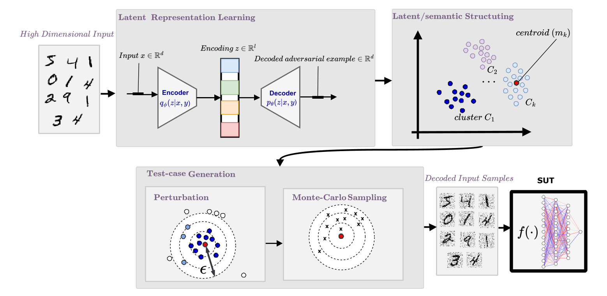
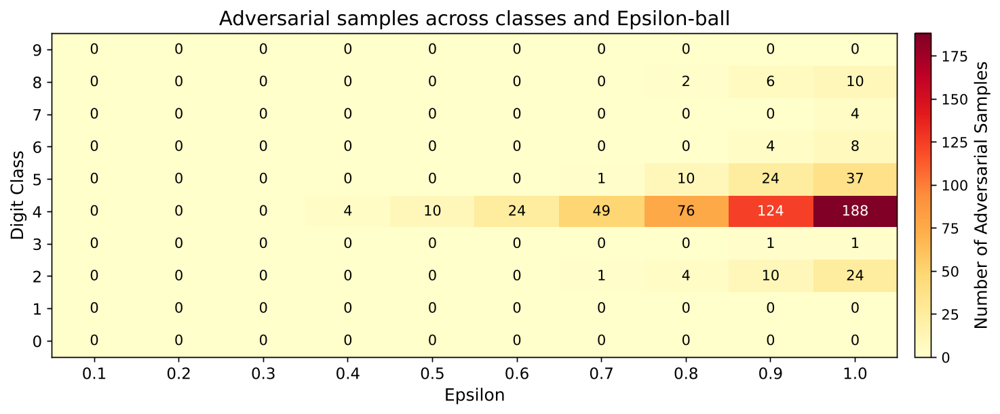
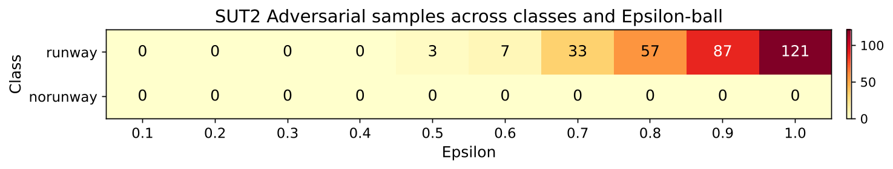

# ASAB
Computer vision systems achieve strong perfor-
mance but remain vulnerable to adversarial perturbations, posing
risks in safety-critical applications. Existing adversarial testing
methods focus on worst-case perturbations near individual inputs
using gradient-based or surrogate approaches. These methods are
computationally expensive, provide limited coverage, and often
generate unrealistic samples in high-dimensional spaces, yielding
only local robustness insights. To address these limitations, we
propose ASAB, a cluster-conditioned latent-space adversarial
testing framework based on Conditional Variational Autoen-
coders.
------------------------
General informations
------------------------
### Folder structure:
- Experiment 1: ASAB Evaluation on Controlled scenarios based on MNIST dataset.
- Experiment 2: ASAB Evaluation on complex application for runway detection.
------------------------
### How To:
1. Clone the repository and navigate to the desired experiment folder.
2. Change the paths in the configs in the Files: CVAutoEncoder/cluster_sample_V1.py and decode_cluster_samples_V1.py.
3. Run the cluster_sample_V1.py to generate the cluster samples.
4. Run the decode_cluster_samples_V1.py to decode the cluster samples to the generate test images.
5. Run SUT/SUT1_fooling.py after adjusting the paths to utilize the correct model. Else just run your model on the generated test images for model evaluation.
6. To repeat Experiment 1/2 adjust the paths along your system and follow the beforehand descriped flow.

------------------------
### Open Tasks:
- The Folder ASAB will be filled with a clean version of the method soon for easier utilization.

------------------------
Methodology
------------------------
The method works in the following steps depicted in the figure below:
1) Latent representation learning
2) Latent and semantic structuring 
3) Test cases generation 
4) Sample decoding and validation

------------------------
Conditional Variational Autoencoder
------------------------
Utilizing a Conditional Variational Autoencoder showed very good performance regarding learning the latent space representation for the use cases enabeling the full method.
The main and most critical part for this was the recreation quality of the generated samples. The [Scenairo reconstruction](Figures/reconstruction performance Scenairo.png) shows the reconstruction performance of the CVAE for the Scenairo data.
The reconstructed images for MNIST can be found in /Experiment 1/CVAutoEncoder/runs/cluster_sampling_by_label_new_area for each epsilon range. 
The higher the epsilon the further the distance to the centroid of the distribution within the latent space.

------------------------
System under Test
------------------------
The system under test are our CNN's for Number and Runway classification.
For both of these models and each possible label test data using ASAB has been generated.
For both cases ASAB was able to generate test data that fooled the model and led to misclassifications based on the decision boundary as shown in the figures below. The only exception is the label no runway, stating that the decision boundary for this classification is either to lose or further away then the maximum epsilon of 1.0 evaluated.

Within the SUT/Results Folder the accouracy and loss over the training can be found.

------------------------
Conclusion
------------------------
In this work, we proposed ASAB, a latent-space adversarial
sampling method for testing CNNs. Instead of searching for
isolated worst-case perturbations around individual inputs,
ASAB uses a CVAE to learn a compact semantic representation of the data and performs structured Monte Carlo sampling
around latent cluster centroids. The experiments on MNIST
and on a domain-specific runway detection case study show
that ASAB can generate adversarial samples while preserving
semantic structure. The results further demonstrate that robustness is not uniformly distributed across classes. For MNIST,
some digit classes remained stable under the tested sampling
budget, while others, especially digit 4, showed substantially
higher adversarial susceptibility. In the runway detection experiment, ASAB identified valid adversarial samples for the
runway class despite the high predictive accuracy of the trained
classifier. For safety-critical applications, ASAB supports a
class-wise robustness analysis: the discovery of adversarial
samples reveals vulnerable regions, while the absence of
detected adversarial samples under a defined sampling budget
provides bounded evidence of robustness for specific classes.
Future work will focus on improving sampling efficiency by
guiding the search toward high-risk regions using density-based sampling, automating the validity assessment of generated samples, and using the identified adversarial examples
for adversarial retraining to improve model robustness.

------------------------
ACKNOWLEDGMENT
------------------------
The authorship team would like to acknowledge the vision,
support and guidance of the IEEE Industrial Electronics Society in conducting the Generative AI Hackathon under the
leadership of Daswin De Silva and Lakshitha Gunasekara.

------------------------
Utilization
------------------------
<b> WE KINDLY ASK YOU TO CITE THIS WORK AS FOLLOWS:</b>  
--- publication details will be added soon ---